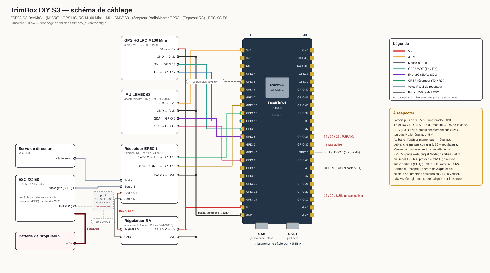

# TrimBox DIY S3

Enregistreur de télémétrie **GPS + inertiel** pour voitures radiocommandées,
avec **chronométrage au tour** affiché et annoncé sur la radio, **console web**
d'analyse et **mise à jour par Wi-Fi**. Construit autour d'un **ESP32-S3**.

> **État :** firmware **2.0-a4**, console **1.7.5**. Tout est écrit et testé
> sur PC, dans un navigateur et dans un émulateur ESP32-S3. **Les essais sur
> le vrai matériel commencent** : voir [les bancs d'essai](#bancs-dessai-à-la-réception-du-matériel).

---

## Sommaire

1. [Ce que fait le module](#ce-que-fait-le-module)
2. [Matériel](#matériel)
3. [Câblage](#câblage)
4. [Mise en route](#mise-en-route)
5. [Utilisation au bord de la piste](#utilisation-au-bord-de-la-piste)
6. [Console web](#console-web)
7. [Radio MT12 et script Lua](#radio-mt12-et-script-lua)
8. [Mises à jour du firmware](#mises-à-jour-du-firmware)
9. [Personnalisation](#personnalisation)
10. [Moniteur série et DEL](#moniteur-série-et-del)
11. [Sécurité et robustesse](#sécurité-et-robustesse)
12. [Dépannage](#dépannage)
13. [Contenu du dépôt](#contenu-du-dépôt)
14. [Compilation et tests automatiques](#compilation-et-tests-automatiques)
15. [Limites connues et suite du projet](#limites-connues-et-suite-du-projet)
16. [Documentation](#documentation)

---

## Ce que fait le module

| Fonction | Détail |
|---|---|
| **Enregistrement autonome** | GPS à 25 Hz + accéléromètre et gyroscope, sur la mémoire interne de 16 Mo. Aucun téléphone nécessaire pendant le roulage. |
| **Autonomie mémoire** | environ **1 h 43 à 25 Hz**, 2 h 09 à 20 Hz, 4 h 17 à 10 Hz, 8 h 34 à 5 Hz, plus de 40 h à 1 Hz (154 333 points). |
| **Filtres d'enregistrement** | attente du GPS, pause automatique à l'arrêt, pause sans signal, extinction après inactivité. Rien n'est stocké au stand. |
| **Chrono embarqué** | calculé dans le module à 25 Hz, temps interpolés entre deux mesures (précision de l'ordre de la milliseconde). Mode **circuit** (une ligne, un temps par tour) ou **dragster** (départ + arrivée, chronos 0-30 / 0-50 / 0-80 km/h et 25 / 50 / 100 m). |
| **Pose de ligne depuis la radio** | en roulant, un appui sur la MT12 pose la ligne à l'endroit où passe la voiture, perpendiculaire à sa trajectoire. Conservée d'une session à l'autre. |
| **Télémétrie radio** | position GPS, vitesse, état, et un message par tour (temps + écart au meilleur) vers la MT12, qui **annonce les temps à voix haute**. |
| **Console Bluetooth** | depuis la page GitHub du projet, sur Chrome Android. |
| **Console Wi-Fi** | le module ouvre son propre réseau quand la voiture est arrêtée depuis 30 s, et le coupe dès qu'elle roule. Fonctionne aussi sur **iPhone**, sans Internet. |
| **Analyse** | tracé coloré par vitesse, zoom, tours et parcours, forces G, temps en l'air, statistiques au survol du tracé, comparaison de sessions. |
| **Exports** | VBO (RaceChrono, Circuit Tools), CSV, GPX ; import de ces mêmes formats. |
| **Mise à jour Wi-Fi** | depuis le téléphone, avec retour automatique à la version précédente si la nouvelle ne démarre pas correctement. |

---

## Matériel

| Élément | Référence utilisée | Rôle |
|---|---|---|
| Carte | **ESP32-S3-DevKitC-1, module WROOM-1-N16R8** | 16 Mo de flash, 8 Mo de PSRAM, Bluetooth, Wi-Fi |
| GPS | **HGLRC M100 Mini** (u-blox M10) | position et vitesse à 25 Hz |
| Centrale inertielle | module **LSM6DS3 / LSM6DS3TR-C** (I2C) | accélérations ±16 g, rotations ±2000 °/s |
| Récepteur | **RadioMaster ER5C-i** (ExpressLRS 2,4 GHz) | commande de la voiture + liaison CRSF avec le module |
| Radio | **RadioMaster MT12** (EdgeTX) | affichage du chrono, pose des lignes |
| ESC | **XC-E8** | lecture prévue par son port X-Bus (à venir) |
| Alimentation | régulateur abaisseur **5 V, ≥ 1 A** | depuis le BEC de l'ESC (6 à 8,4 V) |

Au banc, l'USB de la carte suffit à tout alimenter.

⚠️ **Le module ne pilote jamais la voiture.** Direction et ESC restent sur
les sorties du récepteur : si le module plante, la voiture reste pilotable.

---

## Câblage



Schéma vectoriel : [SVG](docs/cablage-trimbox-s3.svg) · [PDF à imprimer](docs/cablage-trimbox-s3.pdf) (régénéré par `tools/gen_cablage.py`).

| Module | Broche du module | ESP32-S3-DevKitC-1 |
|---|---|---|
| **GPS M100 Mini** | VCC | **5V** |
| | GND | GND |
| | TX | **GPIO 18** |
| | RX | **GPIO 17** |
| **IMU LSM6DS3** | VCC | **3V3** |
| | GND | GND |
| | SDA | **GPIO 8** |
| | SCL | **GPIO 9** |
| **Récepteur ER5C-i** | sortie 2 (Serial TX) | **GPIO 16** |
| | sortie 3 (Serial RX) | **GPIO 15** |
| | − | GND |
| **Alimentation (voiture)** | régulateur 5 V | **5V** + GND |
| ESC X-Bus (plus tard) | signal | GPIO 5, via pont diviseur si 5 V |

**Boîtier imprimé 3D (1/10)** : [docs/boitier/trimbox-boitier.3mf](docs/boitier/trimbox-boitier.3mf),
sans aucune vis : carte clipsée dans le fond, GPS (antenne à l'air libre par
une ouverture) et IMU clipsés dans le couvercle, trou pour voir la DEL, dessous
plat pour adhésif double face + passants pour colliers. Mesures, impression et montage : [docs/boitier/LISEZMOI.md](docs/boitier/LISEZMOI.md).

Réglages du récepteur (interface web de l'ER5C-i, onglet *Model*) :
sorties 2 et 3 en **Serial TX / RX, protocole CRSF** ; direction sur la
sortie 1 (CH1) ; ESC sur la sortie 4 (**CH2**).

Règles à respecter :

- **Jamais plus de 3,3 V sur une broche GPIO** : l'ESP32-S3 ne tolère pas le 5 V.
- **Jamais le BEC (6 à 8,4 V) directement sur la broche 5V** de la carte :
  toujours passer par le régulateur 5 V.
- Broches à ne pas utiliser : 35, 36, 37 (mémoire PSRAM), 19 et 20 (USB),
  0, 3, 45, 46 (démarrage).
- L'IMU se visse **rigidement** sur le châssis, près du centre de gravité,
  axes alignés sur la voiture (pas sur mousse).

---

## Mise en route

Détail pas à pas : **[DEMARRAGE.md](DEMARRAGE.md)**. En résumé :

1. **Envoyer ce dépôt sur GitHub.** L'onglet **Actions** compile et teste
   tout seul (10 à 15 min la première fois).
2. **Activer GitHub Pages** (*Settings → Pages → branche `main`, dossier
   `/ (root)`*) pour la console Bluetooth en ligne.
3. **Premier flash, une seule fois, par câble depuis un ordinateur** :
   artefact `firmware-s3-complet` → `trimbox_s3-complet.bin`, avec
   https://espressif.github.io/esptool-js/ (Chrome ou Edge), adresse **0x0**,
   prise **USB** de la carte.
4. **Vérifier** : 30 s après la mise sous tension, le Wi-Fi
   `TrimBox-Buggy-1` apparaît (mot de passe `trimbox-rc`) ; http://192.168.4.1/
   affiche la console et la version du firmware en haut à droite.
5. **Radio** : copier `lua/trmbox.lua` sur la MT12 et régler le mixage de CH8
   ([lua/LISEZMOI.md](lua/LISEZMOI.md)).

---

## Utilisation au bord de la piste

1. **Brancher la batterie de la voiture.** Le module démarre toujours
   **enregistrement arrêté**.
2. **Démarrer l'enregistrement** depuis la console (Bluetooth ou Wi-Fi).
   Il attend le GPS, puis enregistre dès que la voiture roule.
3. **Rouler.** Le Wi-Fi du module se coupe dès que la voiture dépasse 7 km/h,
   pour ne pas gêner la radio.
4. **Poser la ligne** (une fois par piste) : sur la MT12, page *Lignes*,
   « Poser DEPART », **appui long sur ENT au moment où la voiture passe** à
   l'endroit voulu, à plus de 7 km/h. Double bip = ligne posée.
5. **Chaque tour** : la radio annonce le temps ; double bip aigu avant
   l'annonce s'il s'agit du meilleur tour.
6. **Au stand** : 30 s après l'arrêt de la voiture, le Wi-Fi revient. Le
   téléphone s'y reconnecte, la console aussi : **télécharger** la session,
   analyser, exporter.

Mode **dragster** : poser aussi la ligne d'**arrivée** (« Poser ARRIVEE »).
Un temps par passage départ → arrivée, plus les chronos intermédiaires.

---

## Console web

Un seul fichier (`index.html`), sans aucune dépendance : elle fonctionne sans
réseau. Trois sources de données, au choix en haut de page :

| Source | Quand | Adresse |
|---|---|---|
| **Bluetooth** | Chrome sur Android, ordinateur | `https://<pseudo>.github.io/<dépôt>/` |
| **Wi-Fi** | tout téléphone, dont iPhone ; au stand | `http://192.168.4.1/` (Wi-Fi du module) |
| **Démo** | sans matériel, pour découvrir | `…/index.html?demo=1` |

Fonctions : données en direct, état de la mémoire, démarrage / arrêt et
réglages de l'enregistrement, téléchargement et effacement, analyse
(tracé, tours, dragster, G, sauts), comparaison, exports VBO / CSV / GPX,
mise à jour du firmware (en Wi-Fi), thème clair / sombre et **couleur
d'accent** au choix (bouton palette), installable comme une application
(PWA). L'en-tête affiche la version de la console et celle du firmware de la
carte connectée.

En Wi-Fi, le fond satellite n'est pas disponible (pas d'accès Internet) ;
le reste fonctionne à l'identique, et le téléchargement est bien plus rapide
qu'en Bluetooth.

---

## Radio MT12 et script Lua

Script `lua/trmbox.lua` → carte SD de la radio, `SCRIPTS/TELEMETRY/`.
Mode d'emploi complet : **[lua/LISEZMOI.md](lua/LISEZMOI.md)**.

- **Page Chrono** : dernier tour en grand, numéro, écart, meilleur tour,
  tours précédents ; état du module, lignes posées, indicateur Wi-Fi.
- **Page Machine** : vitesse, vitesse maximale, satellites, qualité de liaison.
- **Page Lignes** : poser le départ, l'arrivée, effacer.
- **Mixage CH8** : source **MAX**, poids **GV9**, mode « ajouter ». Un inter
  3 positions sur CH8 marche aussi sans le script (haut 0,5 s = départ,
  bas 0,5 à 3 s = arrivée, bas 3 s = effacement).
- **Réglage ExpressLRS** : *Telem Ratio* **1:16** ou plus fréquent, sinon
  des messages de tour peuvent manquer.

Messages envoyés à la radio (capteur `FM`) :

| Message | Sens |
|---|---|
| `L12 21.345+0.35` | tour 12 en 21,345 s, 0,35 s de plus que le meilleur |
| `S REC C` | état (REC / PAUSE / STOP / NOFIX) et lignes (C circuit, D dragster, - aucune) |
| `R 0-50 2.184` | chrono intermédiaire (dragster) |
| `K DEPART OK` | accusé de pose de ligne (ou `VIT FAIBLE`, `PAS DE FIX`, `EFFACE`) |
| `W WIFI ON` | Wi-Fi de la console allumé / coupé |
| `U MAJ OK` | étapes d'une mise à jour du firmware |

---

## Mises à jour du firmware

**Par Wi-Fi, sans ordinateur :**

1. Modifier le code dans GitHub (bouton crayon) et valider : la compilation
   repart seule.
2. *Actions* → compilation verte → artefact **firmware-s3-app** →
   `trimbox_s3-app.bin`.
3. Voiture **et** enregistrement arrêtés : console Wi-Fi → **Mise à jour du
   firmware** → choisir le fichier → **Envoyer au module** (environ 10 s).
4. La console se reconnecte et affiche « ✓ Nouvelle version active ».

Filets de sécurité :

- mauvais fichier refusé avec un message clair (fichier « complet », .uf2
  de la v1, autre projet, image corrompue) ;
- l'ancienne version n'est jamais effacée pendant l'envoi ;
- la nouvelle version ne se **valide qu'après 15 s** de bon fonctionnement ;
  si elle plante ou se fige avant, le module **revient seul** à la
  précédente ;
- page de secours : http://192.168.4.1/update.

⚠️ `trimbox_s3/partitions.csv` ne doit **jamais** changer dans une mise à jour
Wi-Fi : la table de partitions ne se remplace que par câble.

---

## Personnalisation

Dans **`trimbox_s3/src/config.h`** :

| Réglage | Par défaut | Rôle |
|---|---|---|
| `DEVICE_NICKNAME` | `"Buggy 1"` | nom du module (16 caractères max) : `TrimBox Buggy 1` en Bluetooth, `TrimBox-Buggy-1` en Wi-Fi |
| `WIFI_PASS` | `"trimbox-rc"` | mot de passe du Wi-Fi du module (**à changer**, 8 caractères min.) |
| `WIFI_AUTO_DEFAULT` | `1` | Wi-Fi automatique à l'arrêt (0 : seulement à la demande) |
| `WIFI_AUTO_ON_S` | `30` | secondes d'arrêt avant l'ouverture du Wi-Fi |
| `CRSF_LINE_CHANNEL_DEFAULT` | `8` | voie radio de pose de ligne |
| `PIN_LED_RGB` | `48` | DEL de la carte : **38** sur une DevKitC-1 v1.1 |
| `AXIS_*` | capteur à plat, x vers l'avant | orientation de l'IMU selon son montage |

Les autres valeurs du fichier ont été fixées par mesure ou par contrainte
matérielle : ne pas les modifier sans raison (voir les cahiers des charges).

Plusieurs voitures : un pseudo différent par module suffit à les distinguer
(Bluetooth, Wi-Fi et console).

---

## Moniteur série et DEL

Moniteur série à **115 200 bauds**, sur la prise **USB** de la carte
(onglet *Console* d'esptool-js, moniteur de l'IDE Arduino, PuTTY…) :

| Touche | Effet |
|---|---|
| `s` | arrêt d'urgence de l'enregistrement |
| `r` | démarrer l'enregistrement (essai sans téléphone) |
| `w` | Wi-Fi marche / arrêt |
| `i` | état : mémoire, enregistrement, configuration, lignes |
| `b` | banc d'essai : cadence GPS, IMU, radio, Bluetooth, Wi-Fi, partition du firmware |
| `z` | configuration par défaut (données conservées) |
| `?` | aide |

**Bouton BOOT**, appui long de 3 s : Wi-Fi marche / arrêt.

**DEL de la carte :**

| Couleur | Sens |
|---|---|
| rouge clignotant | GPS ou mémoire absents (normal au banc sans GPS) |
| rouge fixe | enregistrement en cours |
| orange | enregistrement en pause |
| vert clignotant | GPS calé, prêt |
| bleu fixe | console connectée |
| bleu clignotant | Wi-Fi ouvert, en attente du téléphone |

Les couleurs se superposent : rouge + bleu = violet (enregistrement en cours, console connectée).

---

## Sécurité et robustesse

- **Coupure d'alimentation** (batterie arrachée en pleine session) : les
  données déjà enregistrées restent intactes et téléchargeables ; la
  configuration est écrite en double exemplaire ; l'enregistrement **ne
  reprend jamais tout seul** au redémarrage ; les points incomplets sont
  écartés à la lecture.
- **Effacement de la mémoire** : impossible pendant un enregistrement, et
  non annulable une fois lancé (il ne dure que quelques secondes).
- **Wi-Fi coupé en roulant**, quel que soit le réglage : la liaison de
  commande 2,4 GHz passe avant la console.
- **Chien de garde** : si le programme se fige plus de 5 s, la carte
  redémarre seule.
- **Protocole** : trames avec somme de contrôle, réassemblage tolérant aux
  pertes ; une trame corrompue ne peut pas produire de valeurs absurdes
  dans l'analyse.

---

## Dépannage

| Problème | Piste |
|---|---|
| Carte non détectée pour le flash | câble de **données**, prise **USB** ; BOOT maintenu + RST, relâcher BOOT |
| Pas de Wi-Fi `TrimBox-…` | attendre 30 s voiture arrêtée ; appui long BOOT ; touche `w` ; vérifier le journal série |
| « Pas d'accès Internet » sur le téléphone | normal : rester connecté et ouvrir http://192.168.4.1/ |
| `[gnss] AUCUNE RÉPONSE` | TX et RX croisés (GPS TX → GPIO 18), alimentation 5 V |
| GPS à moins de 25 Hz | normal à l'intérieur ; si Galileo est coupé tout seul, le noter (réglage automatique) |
| `[imu] ABSENTE` | SDA = 8, SCL = 9, 3,3 V, masse |
| Radio : « PAS DE LIAISON » | récepteur : sorties 2/3 en CRSF, TX/RX croisés ; *Découvrir les capteurs* sur la MT12 |
| Des tours manquent sur la radio | *Telem Ratio* ExpressLRS trop bas : 1:16 ou plus fréquent |
| Ligne refusée « VIT FAIBLE » | poser la ligne en roulant à plus de 7 km/h |
| Mise à jour refusée | lire le message : enregistrement en cours, mauvais fichier, voiture en mouvement |
| Console : ancienne version affichée | recharger la page ; en Bluetooth, vider le cache du navigateur |
| La compilation GitHub échoue | ouvrir l'étape en rouge dans *Actions* ; le premier test en échec indique la cause |

---

## Contenu du dépôt

```
trimbox_s3/                      firmware ESP32-S3 (croquis Arduino)
│   trimbox_s3.ino               point d'entrée
│   partitions.csv               table de partitions 16 Mo — NE PAS MODIFIER
│   LISEZMOI.md                  câblage, premier flash, bancs d'essai
└── src/
    ├── config.h                 réglages et brochage
    ├── app.cpp                  boucle principale, commandes, chrono, Wi-Fi auto
    ├── console_gz.h             console intégrée (générée, ne pas éditer)
    ├── core/                    logique SANS matériel, testée sur PC :
    │                            protocoles (TrimBox, UBX, CRSF), chrono,
    │                            automate d'enregistrement, pose de ligne,
    │                            configuration A/B, serveur HTTP/WebSocket,
    │                            contrôle des mises à jour
    └── hw/                      pilotes : GPS, IMU, mémoire, Bluetooth,
                                 Wi-Fi, radio, mise à jour
lua/trmbox.lua                   script de télémétrie MT12 (+ LISEZMOI.md)
index.html                       console web (GitHub Pages et firmware)
trimbox-sw.js                    service worker (console hors ligne)
trimbox-diy-console-demo.html    redirection des anciens liens vers la démo
tools/embed_console.py           intègre index.html au firmware
tests/native/                    tests de la logique (g++) + comparaison avec la console
tests/web/                       console dans un navigateur, avec le serveur du firmware
tests/lua/                       script Lua avec l'API EdgeTX simulée
tests/qemu/                      firmware complet dans l'émulateur ESP32-S3
.github/workflows/build-s3.yml   compilation et tests à chaque envoi
CAHIER-DES-CHARGES.md            spécification v1 (protocole, console, pièges)
CAHIER-DES-CHARGES-V2.md         spécification v2 (ESP32-S3, radio, Wi-Fi, OTA)
trimbox-etat-projet.json         état du projet, pour reprendre avec une IA
```

---

## Compilation et tests automatiques

À chaque envoi sur GitHub, l'onglet **Actions** enchaîne :

| Étape | Vérifie |
|---|---|
| Tests natifs | protocoles, chrono (bancs v1 : 5 tours de 20,00 s, ligne en 4 endroits ; dragster à 6 m/s²), automate d'enregistrement, pose de ligne, configuration A/B, serveur web, contrôles de mise à jour — plus de 950 vérifications |
| Chrono firmware = console | les mêmes trajets rejoués dans les deux : écart maximal 1 ms |
| Script Lua | messages, sons, impulsions GV9, affichage (API EdgeTX simulée) |
| Compilation | ESP32-S3, core `esp32:esp32@3.3.12`, NimBLE-Arduino 2.5.1 (versions figées) |
| Console dans un navigateur | chargement, connexion Wi-Fi, direct, téléchargement, reconnexion, couleur, envoi du firmware compilé |
| Émulateur | Wi-Fi automatique à l'arrêt, pose de ligne par le script Lua, tours de 12,000 s reçus sans perte, coupure d'alimentation, retour arrière après une mise à jour qui plante |

Artefacts produits :

| Artefact | Contenu | Usage |
|---|---|---|
| `firmware-s3-complet` | `trimbox_s3-complet.bin` (+ fichiers séparés) | premier flash, par câble, adresse 0x0 |
| `firmware-s3-app` | `trimbox_s3-app.bin` | mise à jour par Wi-Fi |
| `capture-console-wifi` | capture d'écran | contrôle visuel de la console |

Il faut être **connecté à GitHub** pour télécharger un artefact.

---

## Limites connues et suite du projet

- **Essais matériels en cours** : Bluetooth, Wi-Fi, IMU et GPS réels n'ont
  pas encore été validés sur la carte (bancs d'essai ci-dessous).
- **ESC XC-E8** : lecture par le port X-Bus prévue, en attente de captures
  du protocole à l'analyseur logique (annexe A du cahier des charges v2).
- **Script Lua** : à valider sur la MT12 (lecture du capteur `FM`, touches,
  lisibilité).
- **Premier flash** : nécessite un ordinateur, une seule fois.

### Bancs d'essai à la réception du matériel

Dans l'ordre, en notant la sortie de la touche `b` à chaque étape
(détail dans [trimbox_s3/LISEZMOI.md](trimbox_s3/LISEZMOI.md)) :

1. carte seule : démarrage, mémoire, Wi-Fi, console ;
2. + GPS, dehors : 25 Hz ;
3. + IMU : capteur reconnu ;
4. + récepteur : liaison CRSF, capteurs découverts sur la MT12 ;
5. console : connexion, enregistrement, téléchargement, effacement ;
6. roulage : pose de ligne, tours sur la radio, comparaison avec la console.

---

## Documentation

| Document | Contenu |
|---|---|
| [DEMARRAGE.md](DEMARRAGE.md) | mise en ligne, premier flash, mises à jour |
| [trimbox_s3/LISEZMOI.md](trimbox_s3/LISEZMOI.md) | câblage, flash, moniteur série, bancs d'essai |
| [lua/LISEZMOI.md](lua/LISEZMOI.md) | installation du script, mixage, utilisation |
| [CAHIER-DES-CHARGES.md](CAHIER-DES-CHARGES.md) | spécification v1 : protocole, console, **pièges connus (§9)** |
| [CAHIER-DES-CHARGES-V2.md](CAHIER-DES-CHARGES-V2.md) | spécification v2 : matériel, radio, Wi-Fi, mise à jour, **pièges (§10)** |
| [trimbox-etat-projet.json](trimbox-etat-projet.json) | état du projet, à fournir à une IA pour reprendre le travail |

Le format de trame dérive de la documentation du protocole BLE RaceBox
(révision 8). Aucune compatibilité avec l'application RaceBox officielle n'est
recherchée.
