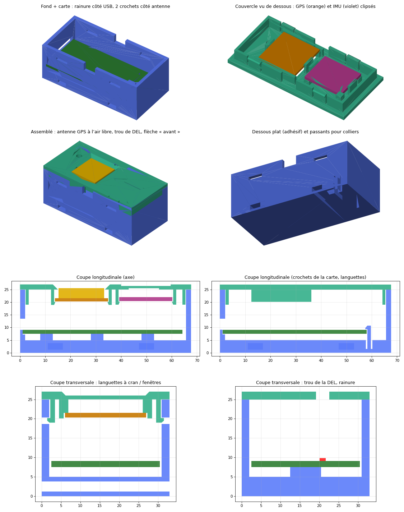

# Boîtier imprimé 3D — voiture 1/10 (v2, sans vis)

Fichier : **`trimbox-boitier.3mf`**. Le fond et le couvercle sont sur le même
plateau et déjà orientés pour l'impression. Le fichier est généré par
`tools/gen_boitier.py`, qui regroupe toutes les cotes en tête de fichier.

| | |
|---|---|
| Encombrement | 67,7 × 33 × 27 mm |
| Intérieur | 63,7 × 29 × 20 mm |
| Fixation | dessous **plat** pour adhésif double face, plus **2 passants** pour colliers (jusqu'à 5 mm de large) |
| Fermeture | **aucune vis** : 4 languettes à cran du couvercle s'enclenchent dans 4 fenêtres du fond |
| Dans le fond | carte ESP32-S3 : **rainure** côté USB et **2 crochets** côté antenne |
| Dans le couvercle | **GPS** clipsé sous une **ouverture** (antenne en vue directe du ciel), **IMU** clipsée, **trou de DEL** |

## Cotes utilisées

| Pièce | Cote | Réglage dans le script |
|---|---|---|
| Carte ESP32-S3-DevKitC-1 N16R8 | 57 × 28 × 1,6 mm (jeu de 0,5 mm) | `PCB_L`, `PCB_W`, `PCB_T`, `TOL` |
| Débord de l'antenne de la carte | 18 × 6,2 mm | `ANT_W`, `ANT_L` |
| DEL RGB de la carte | 8,8 mm du bord USB, 18,4 mm du bord « bas » | `LED_X`, `LED_Y` |
| Circuit du GPS HGLRC M100 | 21 × 21 × 1,2 mm | `GPS_PCB`, `GPS_PCB_T` |
| Antenne céramique du GPS | 18 × 18 mm, ouverture de 18,6 mm | `GPS_ANT` |
| Module IMU LSM6DS3 | **21 × 17 × 1,6 mm (à vérifier)** | `IMU_L`, `IMU_W`, `IMU_T` |

**Repère de la DEL.** Carte vue de dessus, composants vers le haut, prises
USB à gauche. Le bord « bas » est le grand côté le plus proche de vous. Si la
DEL mesurée se trouve de l'autre côté, remplacer `LED_Y` par `28 - 18.4`.

**Pour changer une cote**, modifier la valeur puis relancer
`python3 tools/gen_boitier.py` (dépendance : `pip install manifold3d`).

## Impression

- **PETG** de préférence. Les crochets et les languettes plient d'environ
  3 %, ce que le PETG supporte sans casser. Le PLA convient s'il n'est pas
  démonté souvent. Le PETG tient aussi mieux à la chaleur et au soleil.
- Couche 0,2 mm, 3 périmètres, remplissage 25 %, **sans supports**. Le
  couvercle s'imprime face lisse sur le plateau et l'ouverture du GPS est
  chanfreinée à 45°. L'ouverture USB, les fenêtres et les passants sont des
  ponts courts.
- Pas de filament chargé en carbone ou en métal : il gênerait le GPS et le
  Bluetooth / Wi-Fi.

## Montage (aucune vis)

1. **Carte ESP32-S3** (composants en haut) :
   - glisser le **bord USB** dans la **rainure** de la paroi, les prises face
     à l'ouverture ;
   - abaisser le bout antenne entre les deux crochets et appuyer jusqu'au
     **clic**. Les crochets tiennent la carte et encadrent l'antenne.
   - Pour la sortir, écarter les deux crochets vers le bout du boîtier.
2. **GPS**, antenne céramique **vers le couvercle** :
   - le poser entre les deux guides, sous l'ouverture carrée ;
   - appuyer jusqu'au clic des 2 crochets. L'antenne se retrouve dans
     l'ouverture et voit directement le ciel.
3. **IMU**, **composants vers le couvercle**, sur ses 4 plots :
   - aligner la flèche X du module sur la **flèche gravée** sous le
     couvercle (elle pointe vers le côté USB) ;
   - appuyer jusqu'au clic des 2 crochets.
   - Monté ainsi, le module a la même orientation que « posé à plat,
     composants en haut » : les réglages `AXIS_*` de `config.h` ne changent
     pas.
4. **Câbles** :
   - souder les fils sur la carte, en gardant de la longueur pour ouvrir le
     couvercle à côté du boîtier ;
   - faire sortir les fils vers le récepteur par l'une des **encoches** des
     grands côtés.
5. **Couvercle** : l'orienter de sorte que le **trou de DEL soit côté USB**,
   puis appuyer jusqu'au clic des 4 languettes. Pour l'ouvrir, enfoncer
   les languettes par les fenêtres avec un petit tournevis plat.
6. **Sur la voiture** :
   - **flèche du dessus vers l'avant** ;
   - adhésif double face sous le boîtier et un collier dans chaque passant ;
   - le plus haut et le plus dégagé possible pour le GPS, loin du moteur.

Il n'y a plus de logement de régulateur. La carte est alimentée en 5 V par la
prise servo du récepteur (BEC du variateur). Si un régulateur reste
nécessaire, il se place hors du boîtier, sur le faisceau.

Les prises USB restent accessibles boîtier fermé (flash, journal série), et la
DEL d'état se voit par son trou.
